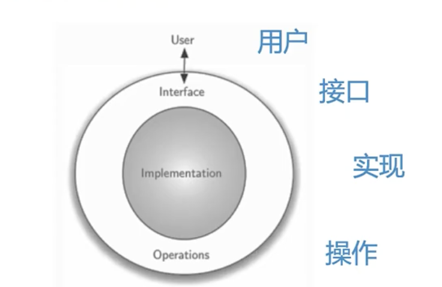
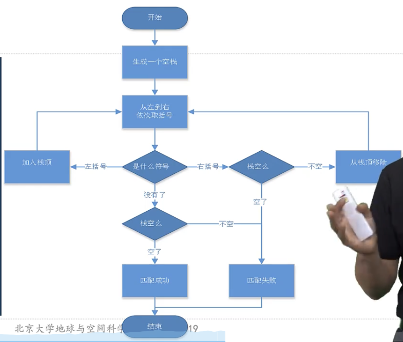
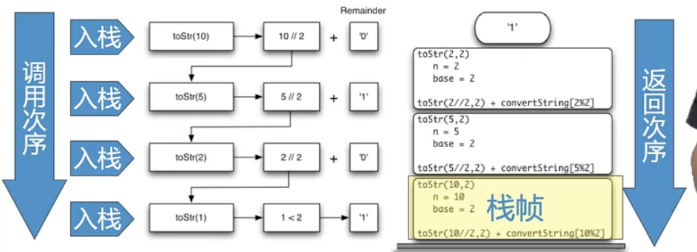

# [【北京大学】数据结构与算法Python版 完整版](https://www.bilibili.com/video/BV1VC4y1x7uv/) 学习笔记
## 1 引入
### 什么是计算
- “计算” 概念的提出
- 为了解决数学本身的可检验性问题（我们能否通过“计算”的方法解决任何问题？），大数学家希尔伯特提出“能否找到一种基于有穷观点的能行方法，来判定任何一个数学命题的真假”的命题
    - 有穷观点的能行方法：
        - 由有限数量的有限指令构成；
        - 在有限步骤后终止
        - 执行结果每次都唯一
        - 原则上人可以单独采用纸笔完成，不需要依靠辅助
        - 指令可以清楚地被执行，不需要智慧或灵感
- 这种命题被否定了，也就是不是所有的问题都是纯粹计算能够解决
- 但是，这种观点成为了计算的基础，推动了科技的发展。
### 图灵机
- 概念（略）
- 例子： “a^{m}和b^{m}的模式判断”
### 算法和计算复杂性
- 世界上最早的确定性算法：辗转相除法。在解决大数的时候很有效。学者说明了某类算法在解决某种特定情境下的问题时是高校的。
- 对于某一个确定的问题，解决方案的不同也对应了解决时间的不同。
- 计算复杂性研究问题本身**有多难**，而不考虑如何解决。
- 算法研究了在不同资源约束下不同的解决方案，致力于**找到最高效**的解决方案。
- 不可计算问题和不可计算数
### 突破计算极限
- 电子计算、光子计算、DNA计算、量子计算
- 众包方案，使用人类的智慧解决问题
### 抽象和实现
- Abstract and Physical 
- 对于系统管理员而言，需要了解计算机的物理层次
- 抽象和物理层次是抽象的
- ***算法 + 数据结构 = 程序***
### 程序设计语言实现算法的机制
- 保持问题的**“整体感”**： 通过抽象和实现。
    - **数据抽象**: 抽象数据类型ADT(Abstract Data Type)
        - ADT是一种对数据进行处理的逻辑描述，不涉及如何具体实现这些处理
            - 
        - 如果需要讨论如何具体实现ADT所对应的功能，那么就要考虑实现这些功能所对应的不同数据结构。
        - ADT的特定功能使用程序设计语言的**控制结构**和**基本数据类型**来实现
        - ADT实现了“逻辑”层次和“物理”层次的分离。
    - **数据实现**
        - 思想：封装，不同层级的工程师注重不同层次的问题
- 学习算法的原因
## 2 算法分析
### 什么是算法分析？
- 程序和算法的关系：
    - 同一个算法：
        算法 + 编程语言1 = 程序1
        算法 + 编程语言2 = 程序2 
        ......
    - 同一个编程语言：
        ...
- 评价程序的好坏：
    - 代码风格
    - 可读性
    ...
- 评价算法的好坏
    - 更加高效地利用计算资源，就是好算法。
- **计算资源是什么？**
    - 算法解决问题所需要的存储空间或内存
    - 算法的执行时间
- 使用time模块计算机系统所需要的时间
    [time模块代码示例](算法分析/time.ipynb)
### 使用大O表示法衡量是占用的时间资源
- 使用**赋值语句**来作为运行步骤的衡量单位。
    - 一条赋值语句包含了*表达式*和*变量*两个单位
    - 对于 “问题规模” n:
        - 赋值语句数量T(n) = 1 + n
    - 算法分析的目标是要找出**问题规模**咋么会影响一个算法的运行时间
- 数量级函数 Order of Magnitute
    - 复杂度 O(f(n))
    - f(n)是问题规模 T(n) 的主导部分 （联系等价无穷小）
    - 常见的大O数量级函数
                | f(n)       | 名称     |
        |------------|---------|
        | 1          | 常数    |
        | log(n)     | 对数    |
        | n          | 线性    |
        | n*log(n)   | 对数线性 |
        | n^2        | 平方    |
        | n^3        | 立方    |
        | 2^n        | 指数    |
### 一个示例问题-”变位词判断问题“
- 核心：解决问题的不同方案复杂度不同。
- [变位词判断问题](/算法分析/变位词判断问题[同一问题的不同算法的复杂度].ipynb)
    - 注意：时间和空间的权衡。
### Python数据类型的性能
- 评估python的list和dict两种数据类型的性能。
    - 20%的功能实现80%的结果--〉让20%的功能跑得最快。
    -  Operation          | Big-O Efficiency |
|--------------------|------------------|
| index []           | O(1)             |
| index assignment   | O(1)             |
| append             | O(1)             |
| pop()              | O(1)             |
| pop(i)             | O(n)             |
| insert(i,item)     | O(n)             |
| del operator       | O(n)             |
| iteration          | O(n)             |
| contains (in)      | O(n)             |
| get slice [x:y]    | O(k)             |
| del slice          | O(n)             |
| set slice          | O(n+k)           |
| reverse            | O(n)             |
| concatenate        | O(k)             |
| sort               | O(n log n)       |
| multiply           | O(nk)            |
- list.pop() 和 list.pop(i) 复杂度的权衡
    - list.pop() 的复杂度是O()
    - list.pop(i) 的复杂度是O(n)
        - pop(i) 的实现方式是将移除元素后面的元素分别向前移动。比较麻烦
        - 但是这种方式保证了列表索引方式的实现复杂度为O(1)
        - 保证了复杂度的权衡。
    - [list.pop()](算法分析/time.ipynb)的计时实验
- dict
    - 大部分dict数据结构更快
## 常见数据结构

### 线性结构
- 定义：线性结构是一种有序数据项的集合，其中每个数据项都有唯一的前驱和后继。
    - 除了第一个没有前驱，最后一个没有后继
    - 新的数据项加入数据集中时，只会嫁到原有的某个数据项之前或之后
    - 具有这种性质的数据集，就称为线性结构
- 不同线性结构的关键区别在数据项的增减方式
    - 只允许一端添加
    - 中间可以添加
    - 可以允许两端删除
    - ...
- 
#### [栈Stack](算法分析/stack.ipynb)
- 栈是一种有次序的数据项集合。在栈中，每个数据项仅从“栈顶”一端加入、移出。
    - 栈顶Top， 栈底称为Base
    - 栈的次序是LIFO(Last In First Out)
    - **后进先出**
- 应用
    - [括号匹配](算法分析/stack.ipynb)
        
    - [进制转换](算法分析/进制转换.ipynb)
#### 队列Queue
- 队列是一个有次序的数据集合，其特征是新数据项的添加总发生在一段（rear），现存数据项的移除总是发生在首端（front)端。
    - 当数据项加入队列，首先出现在队尾，随着首相数据项的移除，它逐渐接近队首。
    - FIFO(First-in-First-Out)
    - [实现Queue数据类型](算法分析/实现queue数据类型.ipynb)
- 应用
    - 计算机科学例子：进程调度----有效地利用了资源；敲击键盘----缓冲区
    - [热土豆]()
#### 双端队列Deque
- 集成栈和队列的性质，两端都可以称为首端或者尾端
#### 列表list
- 列表是一种数据项按照其相对位置存放的数据集，其中数据项指按照位置来索引。（假设不存在重复的数据项）
- 使用**链接表**实现无续表的数据结构
    - Node
        - 包含：
            - 数据项本身
            - 通向下一个节点的引用信息
        - 是链接表的基本结点
    - [自己制作一个链表](算法分析/实现ListADT(链表).ipynb)，能够实现python列表类别的各种功能。

### 递归
- 递归是一种解决问题的方法，在算法流程中，其分解问题的明显特征就是在算法流程中调用自身。
    - [初识递归](算法分析/【初识递归】数列求和.ipynb)
        - 递归“三定律”
            - 必须有基本结束条件【数列问题：列表长度为1】
            - 必须有改变状态，向基本条件演进【数列问题：改变列表并向长度为1演进】
            - 调用自身【数列问题：更短数列的求和问题】
- 递归调用的实现
    - 一个函数被调用的时候，系统会把调用时的**现场数据**压入到系统调用栈，这个**现场数据**被称为**栈帧**。
    - 函数返回时，要从调用栈的栈顶取得返回地址，恢复现场，弹出栈帧，按地址返回
        - 
        - 调用次序和弹出次序相反
    - 特殊的错误：RecursionError,当调用所需要的栈层数超过了系统设置的限度
- 递归可视化
    - [算法分析/【recursive】递归可视化.ipynb](螺旋)
    - 谢尔宾斯基三角
### 分治策略
- 分治策略和递归
    - 将问题分解成若干小问题，各个击破。
        - [找零问题](算法分析/【recursive】递归和分治_找零问题.ipynb)
    - 动态规划方法
        - 采用了**更有条理**的方法找到最优解
        - 当问题的最优解包括**规模更小**的相同问题的最优解，就可以用动态规划来解决
    - 动态规划案例分析
        - [博物馆大盗问题](算法分析/【DevideAndConquer】分治策略（动态规划）_博物馆大盗.ipynb)
### 排序问题
- 具有线性关系的数据，顺序查找。
    - 无序查找代码: 让index = index + 1，从左到右进行索引查找。对于查找算法的过程中，基本的计算步骤就是进行数据项的**比对**，在这种情况下，总的数据长度就是查找的复杂度`O(n)`
    - 有序查找代代码：如果列表是有序的（例如从小到大），那么如果要查找50时，直接跳到了54，由于54 > 50，所以直接返回没有找到。节省了查找次数，但是不能够减少算法复杂度（仍然是O(n))
#### 二分查找
    - [二分查找](算法分析/【sorting】排序算法集合.ipynb)
    - 复杂度: log(n)     
    - 在排序所需要的复杂度和查找所需要的复杂度中进行权衡
#### 冒泡排序Bubble Sort
    - 从左到右，相近两两比较，如果不一样，互换位置
    - O(n^2)
    - 模型改进：和最后一个比较
#### 插入排序
    - 拿出，和左边数字比较。左大则左右，接着...
    - 复杂度：O(n^2)
    - 当输入的数据本身比较有序时，插入排序的执行步骤会小一些。
#### 谢尔排序
    - 将大列表分成等步长的子列表集合；小列表插入排序；不断缩小步长，至gap =1
    - 复杂度：O(n^{3/2})
#### 归并排序
    - 递归调用，拉链排序。
#### 快速排序
    - 根据某一个中值，把数据表变成两半，两部分分别递归
    - nlog(n)，如果中值选择不好的话，复杂度变成O(n^2)
### 散列(一种新的数据结构)
    - 散列的用处：使得查找的次数降低到常数级别
        - Hash Table, 是一种数据集，其中数据项的存储方式鲤鱼快速定位。
        - 每一个存储位置，称为槽slot，可以用来保存数据项，每个槽有唯一的名称。
    - 散列函数：实现从数据项到存储槽名称转换。
        

